# status-strony

Strona zespołu z panelem `/admin/`, program `healthcheck`, który sprawdza, czy strona odpowiada, i chart Helm, który wdraża całość na Kubernetes. Projekt z kursu „From Zero to DevOps”, rozwijany od Fazy 3 razem z pipeline'em CI/CD.

Utrzymuje: **msj-devops**

## Co jest w repozytorium

| Katalog | Zawartość |
|---|---|
| `healthcheck/` | program w Pythonie: sprawdza listę adresów HTTP i zapisuje raport JSON; `Dockerfile` jego obrazu |
| `chart/status-strony/` | chart Helm: strona, healthcheck co 5 minut i strona statusu |
| `chart/status-strony/files/` | treść strony (strona główna, panel `/admin/`) i konfiguracja nginx: jedyne źródło, z którego korzysta chart i test strony |
| `wdrozenia/dev/`, `wdrozenia/prod/` | wartości chartu dla środowisk |
| `.github/workflows/` | workflow GitHub Actions |

## Jak uruchomić lokalnie

Strona z nginx w kontenerze (bez panelu: plik z hasłami nie jest w repozytorium). Treść ma wyrażenia Helma, więc najpierw renderujesz chart z wartościami `dev`:

```bash
mkdir -p /tmp/strona/html/admin /tmp/strona/nginx
helm template strona-dev chart/status-strony -n f2-dev -f wdrozenia/dev/values.yaml \
  --show-only templates/configmap-strona.yaml > /tmp/strona/configmap.yaml
yq '.data["index.html"]' /tmp/strona/configmap.yaml > /tmp/strona/html/index.html
yq '.data["admin.html"]' /tmp/strona/configmap.yaml > /tmp/strona/html/admin/index.html
yq '.data["default.conf"]' /tmp/strona/configmap.yaml > /tmp/strona/nginx/default.conf
docker run --rm -p 8080:80 \
  -v /tmp/strona/html:/usr/share/nginx/html:ro \
  -v /tmp/strona/nginx/default.conf:/etc/nginx/conf.d/default.conf:ro \
  nginx:1.30-alpine
```

## Pipeline CI/CD

Każda zmiana trafia na `main` Pull Requestem, który musi przejść CI. Po scaleniu pipeline sam buduje obraz, sprawdza go w tymczasowym klastrze i wdraża na `dev`. Na `prod` trafia tylko wersja oznaczona tagiem, po zatwierdzeniu, i to Argo CD w klastrze, a nie pipeline, zmienia prod.

```mermaid
flowchart LR
    PR[Pull Request] --> CI["CI (ci.yml, test-strony.yml)<br/>lint, testy, chart, obraz bez publikacji"]
    CI -->|wymagane sprawdzenia zielone, scalenie| CD1["CD (cd.yml): obraz ghcr.io/msj-devops/healthcheck:SHA<br/>amd64 + arm64"]
    CD1 --> KIND["próba w klastrze kind<br/>(runner GitHuba)"]
    KIND --> DEV["dev: runner w VM<br/>helm upgrade strona-dev w f2-dev + test dymny"]
    DEV -.->|tag vX.Y.Z na commicie z zielonym CD| WYD["Wydanie (wydanie.yml):<br/>obraz SHA dostaje tag X.Y.Z"]
    WYD -->|zatwierdzenie w środowisku prod| PROMO["Pull Request „Prod: healthcheck X.Y.Z”<br/>(wdrozenia/prod/values.yaml)"]
    PROMO -->|zielone sprawdzenia, scalenie| ARGO["Argo CD w klastrze<br/>synchronizuje f2-prod"]
```



### Workflow

| Plik | Kiedy rusza | Co robi | Gdzie |
|---|---|---|---|
| `.github/workflows/ci.yml` | Pull Request, push do `main` | ruff, yamllint, hadolint, actionlint, pytest (3 wersje Pythona), `helm lint` + `kubeconform` dla dev i prod, budowanie obrazu bez publikacji; joby tylko dla zmienionych części, job `CI OK` zbiera wyniki | runnery GitHuba |
| `.github/workflows/test-strony.yml` | Pull Request, push do `main` | strona z chartu w nginx na amd64 i arm64, cele 200/401/404 | runnery GitHuba |
| `.github/workflows/cd.yml` | push do `main` | obraz `ghcr.io/msj-devops/healthcheck:<SHA>` → próba w kind → wdrożenie na `dev` (środowisko `dev`) | runnery GitHuba; job dev na runnerze w VM (etykieta `minikube`) |
| `.github/workflows/wydanie.yml` | push tagu `vX.Y.Z` | tag wersji dla obrazu z SHA (bez budowania), po zatwierdzeniu w środowisku `prod` Pull Request ze zmianą wersji na prod | runnery GitHuba |
| `.github/workflows/nocny-healthcheck.yml`, `dzien-dobry.yml` | harmonogram, Pull Request | healthcheck publicznych celów; informacje o runnerze | runnery GitHuba |

Przekład CI na inne narzędzia (dokumentacja, nieuruchamiany w GitHubie): `ci/.gitlab-ci.yml` (GitLab CI), `ci/Jenkinsfile` (Jenkins: lint i testy).

### Co musi działać

- Gałąź `main` chroni reguła `ochrona-main`: Pull Request, zielone `CI OK` i oba warianty testu strony, bez pominięć.
- Środowisko `dev` (wdrożenia tylko z `main`) i `prod` (wymagane zatwierdzenie, wdrożenia tylko z tagów `v*`).
- Runner w VM jako usługa `actions.runner.msj-devops-status-strony.*`, na użytkowniku bez `sudo`, z kubeconfigiem konta z `wdrozenia/dev/dostep-runnera.yaml` (uprawnienia tylko w `f2-dev`).
- Minikube z Argo CD core i aplikacją `status-strony-prod` (`wdrozenia/argocd/`).
- Sekrety i zmienne środowisk: sekcja [Sekrety i konfiguracja środowisk](#sekrety-i-konfiguracja-środowisk).

### Jak wydać wersję na prod

1. Sprawdź, że zmiana jest na `main` i że przebieg `CD` dla tego commita jest zielony (obraz jest w GHCR, `dev` działa):

   ```bash
   git switch main && git pull
   gh run list --workflow cd.yml --branch main --limit 3      # zielony przebieg dla commita, który wydajesz
   ```

2. Oznacz ten commit tagiem z adnotacją i wypchnij tag (numer wersji: SemVer, wyższy niż ostatni na prod):

   ```bash
   git tag -a v<X.Y.Z> <SHA> -m "Wydanie <X.Y.Z>: <co się zmieniło>"
   git push origin v<X.Y.Z>
   ```

3. Workflow `Wydanie` nada obrazowi tag `<X.Y.Z>` i zatrzyma się na jobie `Promocja na prod`. Sprawdź `dev`, potem zatwierdź: *Actions → Wydanie → Review deployments → prod → Approve* (albo `gh run view <ID>` i link z wyniku).
4. Workflow otworzy Pull Request „Prod: healthcheck <X.Y.Z>”. Kliknij w nim *Approve workflows to run* (sprawdzenia Pull Requestów od workflow nie ruszają same), poczekaj na zielone sprawdzenia i scal.
5. Argo CD wdroży nową wersję w ciągu ok. 3 minut. Bez czekania: `kubectl -n argocd annotate application status-strony-prod argocd.argoproj.io/refresh=normal --overwrite`. Sprawdź wynik (niżej, „Co działa na środowiskach”).

### Jak wycofać wersję

**Dev** (wypychanie: pipeline wdraża konkretny commit). Ponownie uruchom job wdrożenia z przebiegu `CD` dla ostatniego dobrego commita. Zanim zaczniesz, poczekaj na koniec trwających przebiegów `CD` (kolejka). Każde kolejne scalenie do `main` wdroży `dev` z najnowszego commita, więc to rozwiązanie na chwilę: trwałe wycofanie to `git revert` zmiany na `main`.

```bash
gh run list --workflow cd.yml --branch main --limit 10        # ID przebiegu dla dobrego commita (kolumna z ID)
gh run view <ID> --json jobs --jq '.jobs[] | "\(.databaseId) \(.name)"'
gh run rerun <ID> --job <ID joba „Wdrożenie na dev”>
gh run watch <ID>
```

**Prod** (ściąganie: prod jest taki, jak `main`). Wycofanie to Pull Request z commitem cofającym promocję. Nikt nie robi na prod `kubectl` ani `helm`: Argo CD cofnie każdą ręczną zmianę.

```bash
git switch main && git pull
git log --oneline -- wdrozenia/prod/values.yaml               # commit „Prod: healthcheck <X.Y.Z>”
git switch -c wycofanie-<X.Y.Z>
git revert <SHA commita promocji>                             # w opisie: dlaczego wycofujesz
git push -u origin wycofanie-<X.Y.Z>
gh pr create --base main --title "Wycofanie <X.Y.Z> z prod" --body "Powód: …"
```

Po zielonych sprawdzeniach scal, odśwież aplikację Argo CD (krok 5 wydania) i sprawdź wersję na prod. Gdy problem zostanie wyjaśniony, wersję przywracasz tak samo: `git revert` commita cofającego, w nowym Pull Requeście. Jeśli trzeba poprawki, wydajesz nową wersję (`<X.Y.Z+1>`).

### Co działa na środowiskach

```bash
# dev: wersja (SHA) i historia wdrożeń
kubectl -n f2-dev get cronjob strona-dev-healthcheck -o jsonpath='{.spec.jobTemplate.spec.template.spec.containers[0].image}{"\n"}'
helm history strona-dev -n f2-dev --max 5
# prod: wersja w repozytorium, stan Argo CD i obraz w klastrze
grep -A2 'image:' wdrozenia/prod/values.yaml
kubectl -n argocd get application status-strony-prod
kubectl -n f2-prod get cronjob strona-prod-healthcheck -o jsonpath='{.spec.jobTemplate.spec.template.spec.containers[0].image}{"\n"}'
# zachowanie nowej wersji: healthcheck od ręki i jego log
kubectl -n f2-prod create job sprawdzenie-wersji --from=cronjob/strona-prod-healthcheck
kubectl -n f2-prod wait --for=condition=complete job/sprawdzenie-wersji --timeout=120s
kubectl -n f2-prod logs job/sprawdzenie-wersji && kubectl -n f2-prod delete job sprawdzenie-wersji
```

### Testy i lintery lokalnie

W `healthcheck/`, w tych samych wersjach co w CI (`requirements-dev.txt`):

```bash
python3 -m venv .venv && . .venv/bin/activate
pip install -r requirements-dev.txt
python -m pytest
ruff check .
```

healthcheck bez klastra:

```bash
cd healthcheck
python3 -m venv .venv && . .venv/bin/activate
pip install -r requirements.txt
python3 healthcheck.py PLIK_Z_CELAMI.yaml --raport raport.json
```

## Sekrety i konfiguracja środowisk

W repozytorium nie ma żadnych haseł ani skrótów haseł. Konfiguracja aplikacji jest w `wdrozenia/<środowisko>/values.yaml`, a to, czego potrzebuje pipeline, w ustawieniach środowisk GitHuba (*Settings → Environments*):

| Co | dev | prod |
|---|---|---|
| adres strony w historii wdrożeń | zmienna `ADRES_STRONY` środowiska `dev` | zmienna `ADRES_STRONY` środowiska `prod` |
| login do panelu `/admin/` | zmienna `PANEL_LOGIN` środowiska `dev` | w Secrecie w klastrze (niżej) |
| hasło do panelu | sekret `PANEL_HASLO` środowiska `dev`; job „Wdrożenie na dev” zamienia je na skrót i zapisuje w Secrecie `strona-htpasswd` w `f2-dev` | **poza GitHubem**: Secret `strona-htpasswd` w `f2-prod` tworzy ręcznie administrator klastra (przepis: README chartu, „Secret z hasłami panelu”). Pipeline i Argo CD go nie dotykają |

**Zmiana hasła na dev:** `gh secret set PANEL_HASLO --env dev` (pyta o hasło), potem ponowne uruchomienie joba „Wdrożenie na dev” z ostatniego przebiegu `CD` (`gh run rerun <ID> --job <ID joba>`). Bez tego dev ma stare hasło: job czyta sekret, gdy rusza.

**Zmiana hasła na prod:** z konta administratora klastra, z hasłem podanym na wejście (bez zapisywania go w pliku i w historii powłoki):

```bash
read -rsp 'Nowe hasło: ' HASLO; echo
printf '%s:%s\n' <LOGIN> "$(printf '%s' "$HASLO" | openssl passwd -apr1 -stdin)" \
  | kubectl -n f2-prod create secret generic strona-htpasswd --from-file=htpasswd=/dev/stdin --dry-run=client -o yaml \
  | kubectl -n f2-prod apply -f -
unset HASLO
```

Hasło zapisz w menedżerze haseł zespołu. Argo CD nie usunie tego Secretu: nie jest w manifestach w repozytorium.
